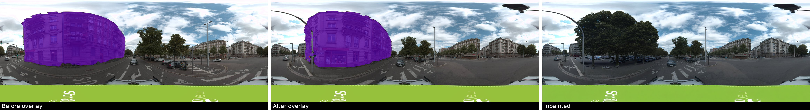
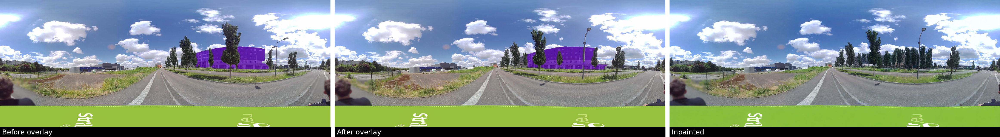
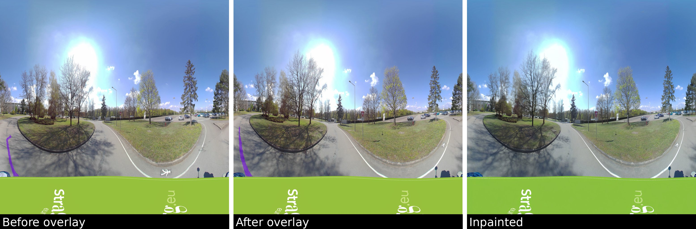
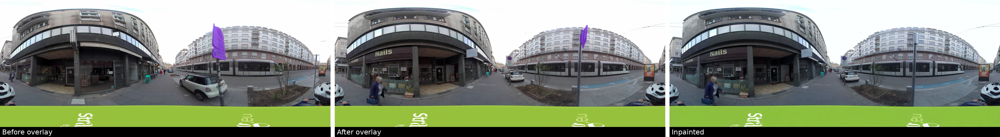

# StreetView Synthetic Change Generator

A pipeline for generating synthetic training data for change detection models. It combines **geometric augmentation** from sequential panoramic street-view images with **semantic changes** synthesized via diffusion-based inpainting, producing realistic before/after image pairs annotated at the pixel and bounding-box level.


## Overview

Training change detection models requires paired images where the same scene appears with and without a meaningful change. Collecting such data in the real world is expensive and slow. This pipeline automates the process:

1. **Geometric/Spatial Augmentation** — Two temporally adjacent images from the same street-view sequence (Panoramax API) are used as the *before* and *after* pair. The viewpoint shift between captures creates a natural geometric augmentation that simulates real-world camera motion.

2. **Semantic Change Synthesis** — SAM3 video tracking segments target objects (buildings, traffic signs, trash cans, etc.) across both images, yielding pixel-accurate masks with cross-frame correspondence. A Stable Diffusion inpainting model then fills the masked region in the *after* image with a synthetically generated change.

The result is a labeled dataset with:
- Aligned before/after image pairs
- Binary segmentation masks for the changed region (both frames)
- Bounding-box annotations in Pascal VOC format
- Per-sample metadata (prompt, class, verification status)


## Pipeline Stages

```
Panoramax sequence
       │
       ▼
 ┌─────────────────────────────────────────────────┐
 │  1. Load & Pair                                  │
 │     Select consecutive image pairs from sequence │
 └───────────────────────┬─────────────────────────┘
                         │
                         ▼
 ┌─────────────────────────────────────────────────┐
 │  2. Detect & Track  (SAM3)                       │
 │     Text-prompted segmentation on frame 1        │
 │     Temporal propagation to frame 2              │
 │     Output: before_mask + after_mask per instance│
 └───────────────────────┬─────────────────────────┘
                         │
                         ▼
 ┌─────────────────────────────────────────────────┐
 │  3. Filter & Select                              │
 │     Remove out-of-class regions                  │
 │     Filter by area; pick 1 or more instances     │
 └───────────────────────┬─────────────────────────┘
                         │
                         ▼
 ┌─────────────────────────────────────────────────┐
 │  4. Synthesize  (Stable Diffusion / FLUX)        │
 │     Inpaint after_mask region in the after image │
 │     Optional: depth / Canny ControlNet guidance  │
 └───────────────────────┬─────────────────────────┘
                         │
                         ▼
 ┌─────────────────────────────────────────────────┐
 │  5. Verify (buildings only)                      │
 │     Re-run SAM3 to confirm object was removed    │
 │     or replaced — labels sample accordingly      │
 └───────────────────────┬─────────────────────────┘
                         │
                         ▼
 ┌─────────────────────────────────────────────────┐
 │  6. Save                                         │
 │     data/   → images, masks, .txt, _meta.json   │
 │     visualizations/ → QC grids, bbox overlays   │
 └─────────────────────────────────────────────────┘
```


## Key Components

| Module | Description |
|---|---|
| [main.py](main.py) | Pipeline orchestrator; iterates sequences and drives all stages |
| [DatasetGenerator.py](DatasetGenerator.py) | Loads and runs diffusion models (FLUX / SDXL / SD) with optional ControlNet |
| [SAM3Correspondence.py](SAM3Correspondence.py) | SAM3 video tracking; returns per-instance mask pairs across frames |
| [utils.py](utils.py) | Image I/O, output directory creation, QC grid rendering, VOC annotation saving |
| [split_train_val_test.py](split_train_val_test.py) | Splits generated dataset into train/val/test (70/15/15) |
| [DAP/](DAP/) | Depth Anything utilities for depth map and surface normal estimation |
| [sam3/](sam3/) | Embedded SAM3 video segmentation model |


## Output Format

For each processed pair the pipeline writes:

```
results_v2/V1.0/
├── data/{sequence_id}/
│   ├── {pair_id}_before.png          # original before image
│   ├── {pair_id}_after.png           # original after image
│   ├── {pair_id}_inpainted.png       # after image with synthetic change
│   ├── {pair_id}_mask_before.png     # binary mask (before frame)
│   ├── {pair_id}_mask_after.png      # binary mask (after frame)
│   ├── {pair_id}_before.txt          # Pascal VOC bounding boxes
│   ├── {pair_id}_after.txt           # Pascal VOC bounding boxes
│   └── {pair_id}_meta.json           # prompt, class, verification status
│
└── visualizations/{sequence_id}/
    ├── {pair_id}_bbox_before.jpg     # before image with bbox overlay
    ├── {pair_id}_bbox_after.jpg      # after image with bbox overlay
    └── {pair_id}_QC.jpg              # 3-panel QC grid (before / after / inpainted)
```


## Supported Change Classes

| Class | Pairing strategy | Inpainting prompt style |
|---|---|---|
| `buildings` | default pairs | removal / facade replacement |
| `cracks` | adjacent pairs only | removal |
| `traffic lights` | default pairs | removal |

Classes and prompts are fully configurable in [config.yaml](config.yaml).


## Results

Each row shows a **before** image (left), the **after** image with tracked mask overlay (center), and the **inpainted** result with a synthetic change (right).

### Buildings — removal / facade replacement



 

### Cracks / Road damage



### Traffic lights — removal




## Usage

```bash
python main.py
```

After generation, split the dataset:

```bash
python split_train_val_test.py
```

---

## Dependencies

- [SAM3](https://github.com/facebookresearch/sam3) — video object segmentation and cross-frame tracking
- [Diffusers](https://github.com/huggingface/diffusers) — Stable Diffusion XL / FLUX inpainting
- [Depth Anything](https://github.com/LiheYoung/Depth-Anything) — monocular depth estimation (optional ControlNet guidance)
- [Panoramax API](https://panoramax.fr) — source of sequential street-view image sequences

